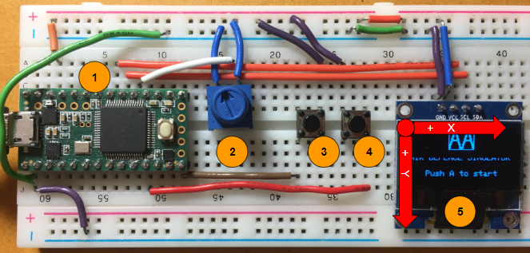
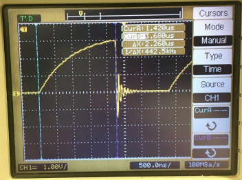

# WelTec Embedded Systems Project 2 - Finite State Machines
By Christian Alexis Luz

# Abstract
An embedded system based game was successfuly demonstrated using the concept of finite state machines and state transition diagrams to control its program flow. Adafruit libraries were also successfully used to conveniently display graphics (mostly bitmaps) on an OLED display driven by a Teensy 3.2. Experiments conducted also found that adding an exteral pull up resistor (170 ohms for this case) to I2C devices improved signal integrity by reducing the time it takes for a signal to reach its full value.

# Introduction

## Objectives and Requirements
The objective of this project is to design, implement, and verify the functionality of an embedded electronic system based game modelled as a finite state machine.

For this purpose, a Teensy 3.2 development board will be utilized to drive a 128 x 64 pixel SDD1306 I2C OLED display to present the game to the player . Device inputs includes a potentiometer and two software debounced buttons. Button functionality will vary based on the current state of the system, which will be discussed in detail later in this report.

The following minimum features are required:

- Implementation of a start screen, the game itself, and an endscreen.
- Display player score during the game and at the end of the game.
- Debouncing implemented for button inputs.
- Design and implementation of a finite state machine.
- Use of Adafruit_SSD1306 and Adafruit_GFX libraries to drive the OLED display if preferred.
- Measure/capture of a sample waveform from the I2C clock and data line. Show and discuss the impact of pull up resistors on signal integrity.

## Discussion of Key Concepts
A finite state machine (FSM) is a machine that is defined by a finite amount of conditions of existence called 'states' (ScienceDirect, n.d.). It is a computational model used to show control execution flow (Bors, 2018).

The OLED (organic light-emitting diode) display used for this project utilizes the inter-integrated circuit (I2C) protocol for communication. From information gathered from lectures attended by the author of this report, I2C is a serial, half-duplex, and synchronous communication protocol. A circuit schematic of a system that uses the protocol is seen below (Pico Technology, n.d.):

 

In the context of this project, there is only one master (the Teensy 3.2) and one slave (SDD1306 128 x 64 pixel OLED display). Serial data is sent through the SDA line while the clock data is sent by the master via the SCL line. Being an open drain system, pull-up resitors on the SDA and SCL lines are needed - the effects of which when varied will be discussed later in this report.

# METHODOLOGY
A game called 'AA' (Anti-Aircraft) of the programmer's own conception is designed, implemented, and tested for this embedded system project on finite state machines.


The player takes control of an anti-aircraft vehicle to prevent enemy airplanes from passing through. The player can fire the vehicle's cannon with a push button and control the cannon's orientation using an analog input potentiometer. Each plane takes two hits to destroy (granting 1 point) and the game ends when three planes survive (player life reaches 0 at this point).

## Circuit Design

The circuit designed for this project is seen in the schematic below:


- Push buttons Button_a and Button_b serve as inputs to the game. The function of these buttons change as the state of the game changes. During the playing state for example Button_a fires the player's cannon. In the start screen state, Button_a starts the game.
- The Teensy 3.2 serves as the central processing unit of this system, taking inputs from the player and rendering pixel based graphics via I2C communication in the OLED screen.
- The 10k ohm POT (potentiometer) serves as an analog input to the game. It is used to aim the player's cannon.
- THe SDD1306 serves as the main display of the system.

## Circuit Implementation
Pictured below is the implemented system circuit:



1. Teensy 3.2
2. 10k ohm potentiometer - analog input
3. Button a
4. Button b
5. OLED Display SSD1306, 128 x 64 pixels

Note: Internal pulldown resistors are used for push buttons a and b to prevent their input pins from floating. Coordinate system orientation utilised by program indicated by red arrows in the photo above.

## Program Design - State Transition Diagram

As required by the project brief, the game must have at least a start screen, the actual game, and an endscreen (game over). The program therefore has several well defined states (states wherein its behaviour is well defined). The system can then be thought of as a finite state machine (FSM) that can be modelled with a state transition diagram (MATLAB, 2014). It is worthwhile to note that systems with dynamic continuously varying behaviour (such that the system cannot be described in one state) would not be suitable for use with the finite state machine model (MATLAB, 2014).

It was decided to use the states listed below for this game:
- START_SCREEN - Introduction screen showing the game logo and a prompt to start the game.
- PLAYING - The actual gameplay mode, which lasts until the player loses all of his/her lives or if he/she chooses to reset the game.
- PAUSED - Stops gameplay. Allows gameplay to resume at the point at which it was stopped or to reset the game and bring the player back to the START_SCREEN state.
- GAME_OVER - The system shifts to this state once the player loses all of his/her lives. The final score is displayed, and a prompt is shown to restart the game, redirecting the player back to the START_SCREEN state.

State transition diagrams (STD) illustrate how the states of a FSM transition to one another and what behaviour is exhibited during each state. The core elements of an STD include: An initial step, transitions/events, states, and actions/behaviours (MATLAB, 2014). A Moore style STD will be utilised for this project, where the actions/behaviours are defined within the state (MATLAB, 2014). Actions/behaviour in this section will be described qualitatively, they will be defined formally in the program implementation subsection of this report.


## Program Implementation - Setup, example code, and libraries

Being an I2C device, the address of the OLED SSD1306 display needs to be determined so that the Teensy 3.2 can interface with it. Feldmann (2012) provides an I2C scanner program for Arduino which can be found at https://gist.github.com/tfeldmann/5411375. Running Feldmann's program in the Teensy 3.2 in the circuit implmimplemented yielded the following serial terminal output:


The OLED display address is determined to be 0x3c which is then inputted into the section of code below:

```c
// SSD1306_SWITCHCAPVCC = generate display voltage from 3.3V internally
  if (!display.begin(SSD1306_SWITCHCAPVCC, 0x3C))
  { // Address 0x3D for 128x64
    Serial.println(F("SSD1306 allocation failed"));
    for (;;)
      ; // Don't proceed, loop forever
  }
```

The system's program is built on example code by Adafruit Industries (2019) that renders various drawings and animations on the SSD1306 OLED display , which can be found here https://github.com/adafruit/Adafruit_SSD1306/blob/master/examples/ssd1306_128x32_i2c/ssd1306_128x32_i2c.ino. The example code gave insight as to how images and animations (which is just a series of images) can be rendered through pixel manipulation on the OLED display using the functions that it demonstrated.

The example code includes four libraries and an additional library added by the author for this particular project:

```c
#include <SPI.h>
#include <Wire.h>
#include <Adafruit_GFX.h>
#include <Adafruit_SSD1306.h>
#include <BITMAPS.h>
```

SPI.h and Wire.h handle SPI and I2C communication respectively, with only the latter library being used since the OLED display is an I2C device. Adafruit_SSD1306.h and Adafruit_GFX.h, both by Adafruit Industries (links are provided in the RELEVANT LIBRARIES AND PROGRAMS section of this report), handle hardware communication and high level graphical commands (such as drawing circles, lines, etc.) respectively (Adafruit Industries, n.d.). BITMAPS.h contains the games 'sprites' or drawings that represent the backgroud scenery of the game, the tank (anti-air vehicle), the enemy plane, and the game logo. These sprites were drawn by the report author using https://www.pixilart.com/ and converted to BMP (a format that can be rendered by the program) using an online conversion tool http://marlinfw.org/tools/u8glib/converter.html.

As an initial experiment, the example code was trimmed to just show the falling stars animation. Code was written to determine the frame rate of the system with this animation being rendered:


A frame rate of about 28 frames per second was observed. Since this was tested using a trimmed down program, this is expected to be the maximum frame rate of the final game.

## Program Implementation - State Transition Diagram / Finite State Machine Implementation

Refer to program comments for more details.

The main program states and their respective behaviour (represented as functions defined outside the main program loop) are contained within the main loop. First, the game states must be declared by using 'enum':

```c
//Declaration of possible states
enum game_states //Define possible game states
{
  START_SCREEN,
  PLAYING,
  PAUSED,
  GAME_OVER,
};
static enum game_states current_game_state = START_SCREEN;
```

The state transition diagram can then be implemented in the main loop using a switch case structure, with each case representing a game state containing behaviour (functions) to be performed during that state (cases collapsed for clarity):


The states call functions to dictate how the syste should behave when that particular state is active. Most of these actions are drawing commands to the display. All of these drawing commands are first collected in the buffer then finally displayed to the player by the 'display.display();' line. The previous buffer is then erased by the line 'display.clearDisplay();' to facilitate the updated set of graphics to be drawn next (such as when a launched projectile's position is updated or as the enemy plane moves).

The states also control what the push buttons do (these push buttons are debounced and are attached to interrupts). For example during the PLAYING state we see Button_a's behaviour:

```c
//Launch a projectile
    if (button_a_pressed == true)
    {
      player_fired_flag = true;
      button_a_pressed = false;
    }
```
And for the GAME_OVER state, we see Button_a's behaviour changed to:

```c
 //Restart the game
    if (button_a_pressed == true || button_b_pressed == true)
    {

      button_a_pressed = false;
      button_b_pressed = false;
      current_game_state = START_SCREEN;
    }
```
Without the switch case structure, nested if statements will be needed - unnecessarily complicating the program.

## Program Implementation - Behaviour Coding Using Functions

Refer to program comments for more details.

This section will briefly discuss how state behaviours are defined using functions in the code. Summarized below are the game states and the functions associated with them (the function names were made as self-descriptive as possible):

|Game State        |Associated Functions                |
|----------------|-------------------------------|
|START_SCREEN| draw_start_screen(); reset_data();|
|PLAYING|draw_background(); draw_tank(); draw_plane(); display_player_score_and_life(); calculate_turret_orientation(); draw_turret();  simulate_projectile();|
|PAUSED|draw_pause_screen();    |
|GAME_OVER|draw_game_over_screen();    |

Input behaviour and flag interpretation for each state is shown below. Refer to comments for the corresponding state's response.

For the START_SCREEN state:

```c
//Set game state to PLAYING
    if (button_a_pressed == true)
    {
      button_a_pressed = false;
      current_game_state = PLAYING;
    }
```

For the PLAYING state:

```c
//Set game state to PAUSED
    if (button_b_pressed == true)
    {
      button_b_pressed = false;
      current_game_state = PAUSED;
    }

    //Code omitted for clarity

    //Launch a projectile
    if (button_a_pressed == true)
    {
      player_fired_flag = true;
      button_a_pressed = false;
    }

    //Simulate projectile flight
    if (player_fired_flag == true)
    {
      simulate_projectile();
    }

    //Set game state to GAME_OVER when player life reaches 0
    if (player_life == 0)
    {
      current_game_state = GAME_OVER;
    }
```

For the PAUSED state:

```c
    //Reset game
    if (button_a_pressed == true)
    {

      button_a_pressed = false;
      current_game_state = START_SCREEN;
    }

    //Resume game
    if (button_b_pressed == true)
    {

      button_b_pressed = false;
      current_game_state = PLAYING;
    }
```

And lastly for the GAME_OVER state:
```c
//Restart the game
    if (button_a_pressed == true || button_b_pressed == true)
    {

      button_a_pressed = false;
      button_b_pressed = false;
      current_game_state = START_SCREEN;
    }
```

Most objects drawn on screen are generated by the function below (in drawing the static tank for example):

```c
display.drawBitmap(0, (SCREEN_HEIGHT - TANK_HEIGHT), TANK_BMP, TANK_WIDTH, TANK_HEIGHT, 1);
```

Bitmaps models are kept in a separate header file BITMAPS.h for better code readability. The key arguments to the bitmap function are x position, y position, BMP model to use, BMP width, and BMP height.

For moving objects, the same code above is used but variables are utilized for the x and y position that are updated after every cycle of the main loop - such as for the plane:

```c
void draw_plane()
{

  static uint8_t PLANE_DELTA_X = random(1, 3);
  const uint8_t CRASH_SPEED_Y = 4;
  static bool player_score_added = false;

  switch (current_plane_state)
  {

  case FRESH:
    //Draw and animate plane
    display.drawBitmap(PLANE_X_POSITION, PLANE_Y_POSITION, PLANE_BMP, PLANE_WIDTH, PLANE_HEIGHT, 1);
    PLANE_X_POSITION = PLANE_X_POSITION - PLANE_DELTA_X;
    //Damage plane when hit
    if (plane_hit_flag == true)
    {
      current_plane_state = DAMAGED;
      plane_hit_flag = false;
    }
    break;
```

Where PLANE_DELTA_X controls how fast the plane moves. The plane then respawns at a random start point and with a random speed when it exits the screen:

```c
//Prepare to spawn new plane once plane exits screen, subtract 1 life if plane that exits is damaged or fresh
  if ((PLANE_X_POSITION <= -PLANE_WIDTH) || (PLANE_Y_POSITION >= SCREEN_HEIGHT))
  {

    //Subtract one life from player if fresh or damaged plane exits the screen
    if (current_plane_state != DESTROYED)
    {
      player_life = player_life - 1;
    }

    PLANE_X_POSITION = SCREEN_WIDTH;
    PLANE_DELTA_X = random(1, 3);
    PLANE_Y_POSITION = (random(0, 3) * PLANE_HEIGHT);
    current_plane_state = FRESH;
    player_score_added = false;
  }
```
The planes are also modelled as a FSM:


Which facilitates easier coding of  gameplay mechanics such as scoring, plane related animations (such as visually showing damage on the plane seen below), and player life deduction.


Calculating the tank turret angle is critical since it determines the trajectory of the launched projectile. It is handle by the code below:

```c
//Calculate tank turret orientation
void calculate_turret_orientation()
{
  turret_angle_degrees = map(analogRead(ANALOG_INPUT_PIN), 0, 1023, 0, 90); //Map turret angle to analog input pin

  //Calculate turret endpoint using turret angle in degrees
  turret_endpoint_x = TURRET_LENGTH_PIXELS * cos(turret_angle_degrees * (PI / 180)) + (TANK_WIDTH / 2);
  turret_endpoint_y = (SCREEN_HEIGHT - TANK_HEIGHT) - (TURRET_LENGTH_PIXELS * sin(turret_angle_degrees * (PI / 180)));
}
```

After which the turret is drawn:

```c
//Draw tank turret in the correct orientation
void draw_turret()
{

  display.drawLine((TANK_WIDTH / 2), (SCREEN_HEIGHT - TANK_HEIGHT), turret_endpoint_x, turret_endpoint_y, SSD1306_WHITE);
}
```

And upon firing, the projectile moves with a velocity vector slope equal to the slope of inclination of the turret upon firing (note that projectiles are modelled simply as a circle):

```c
//Animate projectile's linear trajectory based on turret angle upon launch and check for hits
void simulate_projectile()
{

  static float projectile_delta_x = 0;          //X component of projectile speed
  static float projectile_delta_y = 0;          //Y component of projectile speed
  static float projectile_angle_degrees = 0;    //Projectile angle decoupled from turret
  float projectile_delta_xy = PLANE_HEIGHT / 2; //Projectile speed, set to a value smaller than the plane height to avoid skipping the plane

  if (projectile_launched == false) //Set projectile angle to turret angle
  {
    projectile_angle_degrees = turret_angle_degrees;
    projectile_delta_x = projectile_delta_xy * cos(projectile_angle_degrees * (PI / 180)); //X component of projectile speed
    projectile_delta_y = projectile_delta_xy * sin(projectile_angle_degrees * (PI / 180)); //Y component of projectile speed
    projectile_launched = true;
  }

  else if (projectile_launched == true) //Decouple projectile angle from turret angle
  {

    projectile_delta_x = projectile_delta_xy * cos(projectile_angle_degrees * (PI / 180)); //X component of projectile speed
    projectile_delta_y = projectile_delta_xy * sin(projectile_angle_degrees * (PI / 180)); //Y component of projectile speed
  }

  int32_t MAX_X_RANGE_PIXELS = SCREEN_WIDTH;  //Set projectile max range to that of the screen size
  int32_t MAX_Y_RANGE_PIXELS = SCREEN_HEIGHT; //Set projectile max range to that of the screen size

    display.drawCircle(projectile_position_x_pixel, projectile_position_y_pixel, 1, SSD1306_WHITE); //Draw projectile

  //Update projectile position
  projectile_position_x_pixel = projectile_position_x_pixel + projectile_delta_x;
  projectile_position_y_pixel = projectile_position_y_pixel - projectile_delta_y;
```

And hits on a plane are tracked and responded to:

```c
//Check if projectile hits
  if ((projectile_position_x_pixel >= PLANE_X_POSITION) && (projectile_position_x_pixel <= (PLANE_X_POSITION + PLANE_WIDTH)))
  {
    if ((projectile_position_y_pixel >= PLANE_Y_POSITION) && (projectile_position_y_pixel <= (PLANE_Y_POSITION + PLANE_HEIGHT)))
    {

      display.drawCircle(projectile_position_x_pixel, projectile_position_y_pixel, 8, SSD1306_WHITE); //Change projectile to its exploded version

      projectile_launched = false; //'Despawn' projectile to allow the creation of a new one

      player_fired_flag = false; //Allow player to fire once again
      //Reset projectile position
      projectile_position_x_pixel = (TANK_WIDTH / 2);
      projectile_position_y_pixel = (SCREEN_HEIGHT - TANK_HEIGHT);

      plane_hit_flag = true; //Register plane hit
    }
```

Otherwise the projectile disappears offscreen and the tank is ready to fire once again:

```c
//Limit projectile travel in the X and Y axes to prevent a non-terminating loop, 'reload' cannon
  if (projectile_position_x_pixel >= MAX_X_RANGE_PIXELS || -projectile_position_y_pixel >= MAX_Y_RANGE_PIXELS)
  {

    projectile_launched = false; //'Despawn' projectile to allow the creation of a new one
    player_fired_flag = false;   //Allow player to fire once again
    projectile_position_x_pixel = (TANK_WIDTH / 2);
    projectile_position_y_pixel = (SCREEN_HEIGHT - TANK_HEIGHT);
  }
```
At the end of the game, the player's score is shown along with further instructions. Note the function used to display text onscreen:

```c
//Draw game over screen
void draw_game_over_screen()
{
  display.drawBitmap(48, 0, LOGO_BMP, LOGO_WIDTH, LOGO_HEIGHT, 1);
  display.setTextSize(1);
  display.setTextColor(SSD1306_WHITE);
  display.setCursor(0, 30);
  display.println("GAME OVER");
  display.setCursor(0, 40);
  display.print("FINAL SCORE: ");
  display.println(player_score);
  display.println("Push any button to");
  display.println("restart the game");
}
```

Lastly, debouncing of buttons was also done as usual good practice as seen for Button_b below for example:

```c
void ISR_button_press_b() //Interrupt service routine that handles inputs from button 'b'
{

  noInterrupts(); //Prevent other interrupts

  //Local variable declarations
  static uint32_t previous_press_time_b_ms = 0; //Previous time noted for debouncing
  uint32_t current_press_time_b_ms = millis();  //Current time noted for debouncing

  if ((current_press_time_b_ms - previous_press_time_b_ms) > DEBOUNCE_DELAY_MS) //Code segment that handles noting of frequency print request, with button debounce
  {
    button_b_pressed = true;

    previous_press_time_b_ms = current_press_time_b_ms; //Updates previous time to facilitate correct debounce timing
  }
  interrupts(); //Re-enable other interrupts
}
```

All other functions not discussed here are described with comments in the code.

## Determining the effect of pull-up resistors on signal integrity

It was required to determine the effect of pull-up resistors on signal integrity (for the SDA and SCL lines). For this purpose, a short series of experiments were conducted.

Starting with the clock line (SCL) a sample waveform was extracted without an external pull-up resistor:



It can be seen that it takes about 2 us for the signal to settle at the target 3 V magnitude. A 170 ohm resistor was then used to pull up the SCL line. The waveform below was generated:


We see the signal integrity improve as it takes much less time for the signal to reach its maximum magnitude (in about 0.25 us). Using a pull-up resistor with a much larger resistance (around 10k ohms) the waveform below was extracted:


The waveform appears to approach the reponse time of the case where no external pull-up reistor was used.

Repeating the experiment for the SDA line, we extract the waveform below without any external pull-up resistor:


It takes about 4.16 us for the signal to settle. Adding an external 170 ohm pull-up resistor:


We see the signal greatly improve as it practically instantly reaches the maximum voltage. Checking the SDA response with a 10k ohm resistor:


Just as it did with the SCL signal, as the pull-up resistor resistance increase a larger delay in settling time is observed.

A small external pull-up resistor (around 170 ohms) would therefore be ideal on the SDA and SCL line. A smaller resistance decreases the time constant of the system, allowing the signal to reach the maximum voltage value in a much shorter period of time.

The author of this report could not determine whether or not there was an internal pull-up resistor for the SDA and SCL lines on the OLED display. Measuring resistance across VCC to SDA and VCC to SCL on the OLED display yield a resistance value of around 5 megaohms - which seemed to imply that there is no connection at all (open circuit).

# RESULTS AND DISCUSSION

The game was found to perform smoothly in the implemented system and was quite enjoyable to play. 

A finite state machine was also successfully modelled in code and the author of this report learned first hand of the usefulness of the model for conceptualizing certain systems.

Problems were initially encountered with plane hit registration. It was found that the projectile should move in pixel steps less than the plane width and height so that it does not 'skip' the plane.

There was also an issue that moving the turret while a projectile is in motion causes the projectile course to deviate. This was solved by decoupling the projectile's trajectory from the turret's orientation right after one cycle, through the use of if statements and flags.

As a point of improvement, the tank's cannon does not reload at a fixed rate (since the projectile can despawn at varying times, depeding on when it hits a plane or exits the screen first). This may affect gameplay for some players and should be addressed in future iterations of the game.

From the signal integrity experiments, it was verified that the addition of an external low resistance pull-up resistor on the SDA and SCL lines greatly increased signal rise time (and therefore signal integrity) and should have been utilised for this and similar systems with I2C communication involved.

# REFERENCES

Adafruit Industries. (2019, September 7). adafruit/Adafruit_SSD1306. Retrieved November 27, 2019, from https://github.com/adafruit/Adafruit_SSD1306/blob/master/examples/ssd1306_128x32_i2c/ssd1306_128x32_i2c.ino

Adafruit Industries. (n.d.). Monochrome OLED Breakouts. Retrieved from https://learn.adafruit.com/monochrome-oled-breakouts/arduino-library-and-examples

Bors, M. (2018, March 11). What is a Finite State Machine?. Retrieved from https://medium.com/@mlbors/what-is-a-finite-state-machine-6d8dec727e2c

Feldmann, T. (2012). A I2C Scanner for Arduino. Retrieved November 27, 2019, from https://gist.github.com/tfeldmann/5411375

MATLAB. (2014, April 9). Understanding State Machines, Part 1: What Are They?. Retrieved from https://www.youtube.com/watch?v=-Yicg2TTMPs

MATLAB. (2014, April 16). Understanding State Machines, Part 2: Why Use Them?. Retrieved from https://www.youtube.com/watch?v=0z0XGXBtI3A

MATLAB. (2014, April 23). Understanding State Machines, Part 3: Mealy and Moore Machines. Retrieved from https://www.youtube.com/watch?v=vwJT2njv6rM

Pico Technology. (n.d.). I²C - serial protocol decoding. Retrieved from https://www.picotech.com/library/oscilloscopes/serial-protocol-decoding-i2c

ScienceDirect. (n.d.). Finite-State Machine. Retrieved from https://www.sciencedirect.com/topics/engineering/finite-state-machine

# RELEVANT LIBRARIES AND PROGRAMS

- I2C Scanner for Arduino - https://gist.github.com/tfeldmann/5411375
- Example code for the SSD1306 OLED Display - https://github.com/adafruit/Adafruit_SSD1306/blob/master/examples/ssd1306_128x32_i2c/ssd1306_128x32_i2c.ino.
- Adafruit_GFX.h - https://github.com/adafruit/Adafruit-GFX-Library/blob/master/Adafruit_GFX.h
- Adafruit_SSD1306.h - https://github.com/adafruit/Adafruit_SSD1306/blob/master/Adafruit_SSD1306.h


# RELEVANT DATASHEETS

- SSD1306 - https://cdn-shop.adafruit.com/datasheets/SSD1306.pdf

- TEENSY 3.2 - https://www.pjrc.com/teensy/techspecs.html


